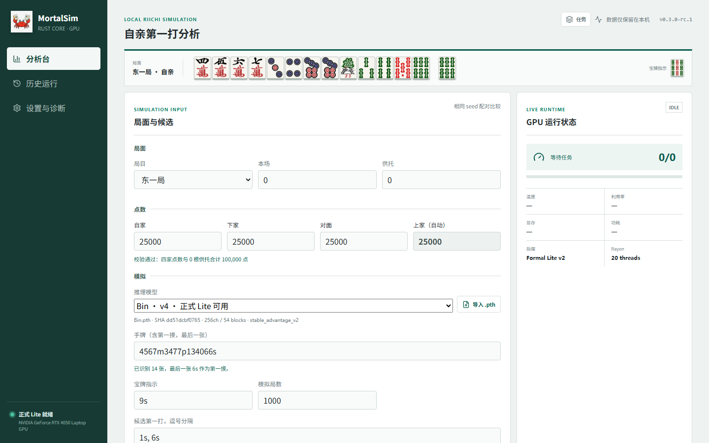
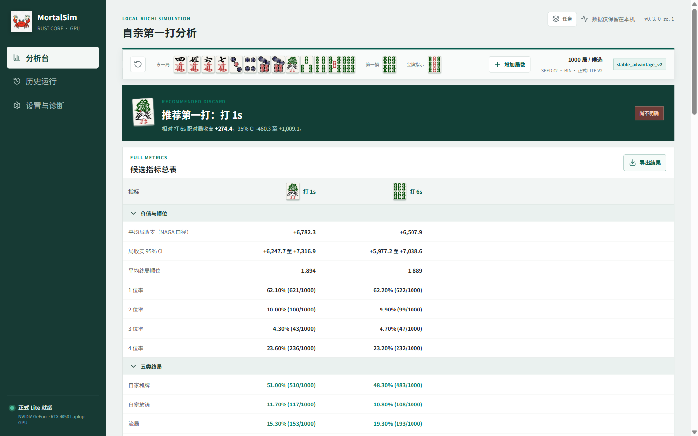
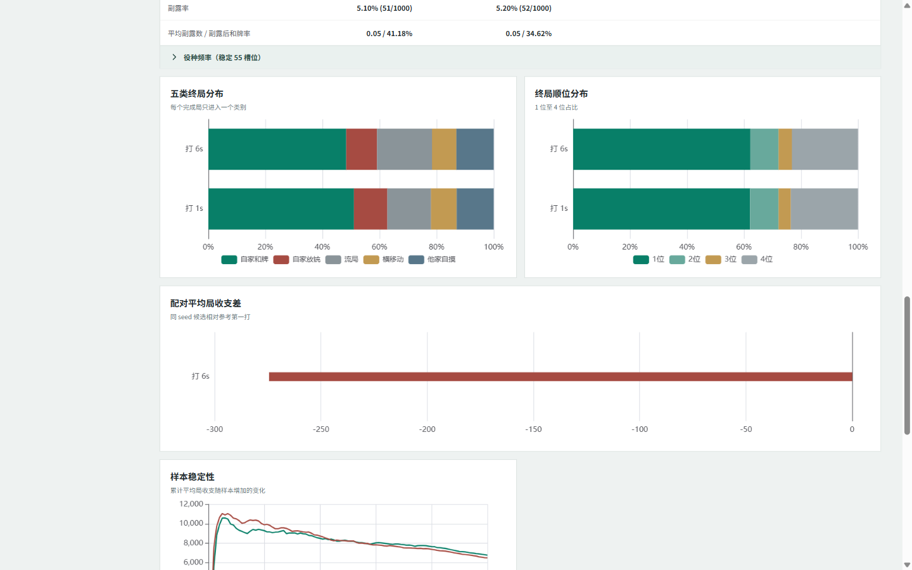

# MortalSim Lite

[English](README.md) | **简体中文**

<p align="center">
  
</p>

MortalSim Lite 是一款在 Windows 本机运行的日麻自亲第一打模拟与比较工具。
它使用 Rust `libriichi` 模拟核心和精简的 CUDA 推理运行时，对多个候选第一打
使用相同 seed 做配对模拟，帮助用户比较平均局收支、五类终局和详细攻防指标。

所有手牌、seed、导入模型、GPU 状态和模拟结果都只保存在本机。MortalSim
不会连接麻将客户端、拦截网络流量、自动操作线上对局或上传用户数据。

> 当前版本为 `v0.3.0-rc.1`。它采用独立定义的
> `stable_advantage_v2` 决策契约，不宣称与旧 PyTorch AMP 位级一致。
> RC 已通过本机 110 万决策、每候选 50,000 局、扩容等价和 30 分钟显存
> 稳定性 Gate。项目决定本次不执行第二台 RTX 40 的跨设备 Gate，因此以 RC
> 公开，不宣称已经完成跨硬件正式版验证。

## 主要功能

- 多个候选第一打的相同 seed 配对比较。
- NAGA 口径平均局收支、95% 置信区间和配对差值。
- 自家和牌、自家放铳、流局、横移动、他家自摸五类互斥终局。
- 自家荣和/自摸、顺位、和牌构成、防守、立直、听牌、副露和役种统计。
- 14 张手牌输入，最后一张自动作为第一摸。
- 配牌即听牌时，可把候选标记为“首打并宣告立直”。
- 后台任务、GPU 温度/利用率/显存监测和随时取消。
- 历史结果保存，以及使用连续 seed 原子追加模拟局数。
- 本地 `.pth` 模型导入、SHA-256 身份和结构校验。
- Excel 全量指标表、完整 JSON 和离线 HTML 导出。

## 界面预览

### 分析台



### 候选结果比较



### 终局、顺位与稳定性图表



## 一、运行前确认

### 1. 系统与显卡

正式 Lite RC 当前只支持：

| 项目 | 要求 |
| --- | --- |
| 操作系统 | Windows 10/11 x64 |
| 显卡 | NVIDIA RTX 40 系列，Compute Capability 8.9 |
| 驱动 | 能正常运行 `nvidia-smi` 的较新 NVIDIA 驱动 |
| 模型 | Mortal v4，256 channels / 54 blocks 的兼容 `.pth` |
| 磁盘 | ZIP 约 34 MiB；应用解压约 72 MiB，另为模型与历史预留空间 |

目前不正式支持 RTX 20/30/50、GTX、AMD、Intel 核显或纯 CPU。检测到非 8.9
计算能力时，应用会明确拒绝运行，不会静默切换后端。

### 2. 不需要安装的内容

使用 GitHub Release 中的 Portable ZIP 时，不需要安装：

- Python
- Rust
- Node.js
- PyTorch
- CUDA Toolkit
- Visual Studio Build Tools

ZIP 已包含应用需要的精简 CUDA 运行时。不要因为 `nvidia-smi` 显示
“CUDA Version 13.x”就另外安装 CUDA Toolkit；该数字表示驱动可支持的最高
CUDA 版本，不是 MortalSim 缺少依赖的提示。

### 3. 检查 NVIDIA 驱动

按 `Win + R`，输入 `powershell` 并回车，然后运行：

```powershell
nvidia-smi
```

正常时会显示显卡名称、驱动、温度和显存。若命令不存在、提示驱动错误或看不到
NVIDIA 显卡，请先从 NVIDIA 官方渠道更新驱动并重启 Windows。

## 二、下载、校验与安装

### 第一步：下载正确的文件

打开 [GitHub Releases](https://github.com/QSshuyunmu/MortalSim/releases)，
进入同一个 `v0.3.0-rc.1` Release，下载：

```text
MortalSim-Windows-x64-Lite-v0.3.0-rc.1.zip
SHA256SUMS-Lite.txt
LITE_VALIDATION-v0.3.0-rc.1.json
```

`SBOM.cdx.json` 是软件物料清单，建议一起保存。不要把 GitHub 自动生成的
`Source code (zip)` 当成 Portable 应用；源码包不含编译后的 Rust 扩展和
原生 CUDA 运行时，不能双击使用。

### 第二步：校验 SHA-256

在下载目录打开 PowerShell：

```powershell
Get-FileHash .\MortalSim-Windows-x64-Lite-v0.3.0-rc.1.zip -Algorithm SHA256
Get-Content .\SHA256SUMS-Lite.txt
```

两个 SHA-256 必须完全相同。当前 RC 的权威值以同一 Release 中的
`SHA256SUMS-Lite.txt` 为准。若不一致，不要运行该文件，应删除后重新下载。

### 第三步：完整解压

将 ZIP 解压到具有读写权限的普通目录，例如：

```text
D:\Apps\MortalSimLite\
```

不要：

- 直接在 ZIP 预览窗口中运行。
- 只把 `MortalSim.exe` 单独复制出来。
- 解压到需要管理员写权限的 `C:\Program Files`。
- 把两个不同版本覆盖到同一目录。

解压后顶层应至少包含：

```text
MortalSimLite\
├─ MortalSim.exe
├─ Start-MortalSim.cmd
├─ Install-MortalSim.ps1
├─ RELEASE_MANIFEST.json
├─ SBOM.cdx.json
├─ docs\
├─ legal\
└─ _internal\
```

`_internal` 是必需目录。牌面、前端、Python 运行时、Rust 扩展和 CUDA 文件
都在其中，不能删除。

### 第四步：启动

双击：

```text
Start-MortalSim.cmd
```

启动器会检测 CUDA 和 SM89 兼容性，选择空闲端口，启动只监听
`127.0.0.1` 的 FastAPI 服务，并打开默认浏览器。地址形如：

```text
http://127.0.0.1:50715/
```

端口每次可能不同，这是正常现象。浏览器只是本地应用界面，不代表应用把数据
发送到了互联网。关闭浏览器标签不会立即取消后台任务；需要退出时请关闭
`MortalSim.exe`。

首次启动可能被 Windows Defender 扫描，速度会比之后慢。若 30 秒后没有页面，
查看：

```text
%LOCALAPPDATA%\MortalSim\logs\launcher.log
```

## 三、首次导入模型

公开源码和 Release 均不包含、托管或下载模型权重。用户必须自行提供本机已有、
可合法使用的兼容 `.pth`。

1. 打开左侧“分析台”。
2. 在“推理模型”区域点击“导入 .pth”。
3. 选择 Mortal v4、256 channels / 54 blocks 的权重。
4. 等待文件上传到本机服务并完成受限读取、结构、张量形状与 SHA-256 校验。
5. 看到“正式 Lite 可用”后，在下拉框中选中该模型。

导入只发生在本机回环连接。通过校验的不可变副本保存在：

```text
%LOCALAPPDATA%\MortalSim\models\
```

之后不依赖原文件路径。重复导入完全相同的文件会按 SHA-256 识别为同一个模型。
损坏文件、压缩 ZIP checkpoint、非 v4、通道数/残差块不符或超过 2 GiB 的文件
会被拒绝，不会加入模型库。

模型校验通过不等于模型来源或使用许可由 MortalSim 背书。用户仍需自行确认。

## 四、完成第一次分析

### 第一步：填写局目、本场与供托

“局面”区域支持东一局至西四局。当前第一打模拟固定“自家为庄家”，局目同时
决定场风和绝对座位映射。

- 本场：整数 `0..99`，默认 0。
- 供托：整数 `0..99`，默认 0。

### 第二步：填写点数

自家、下家和对面的点数可编辑；上家只读并自动计算：

```text
上家 = 100000 - 供托 × 1000 - 自家 - 下家 - 对面
```

四家点数必须非负且为 100 点的整数倍，并满足：

```text
四家点数之和 + 供托 × 1000 = 100000
```

校验状态变绿后才能开始。改变供托会立即重算上家点数。

### 第三步：输入 14 张手牌

手牌字符串必须恰好表示 14 张牌，最后一张固定作为第一摸。例如：

```text
4567m3477p134066s
```

这里会解析为前 13 张配牌加最后一张 `6s` 第一摸，不再单独填写第一摸。

| 记号 | 含义 | 示例 |
| --- | --- | --- |
| `m` | 万子 | `123m` |
| `p` | 筒子 | `456p` |
| `s` | 索子 | `789s` |
| `z` | 东南西北白发中 | `1234567z` |
| `0m` / `0p` / `0s` | 赤五 | `0p` |

输入框支持全角数字、常见中文花色字和逗号/空格清理。仍应确认下方出现 14 张
真实牌面，并且提示的第一摸正确。每种实体牌不能超过四张，赤五计入对应五。

### 第四步：填写宝牌指示

宝牌指示只输入一张，例如：

```text
9s
```

输入的是“宝牌指示牌”，不是实际宝牌。

### 第五步：选择候选第一打

候选可以手动输入：

```text
1s, 6s
```

也可以点击手牌下方的牌面按钮添加或移除。候选必须存在于 14 张手牌中；同一种
牌不会重复创建普通候选。

需要同时比较同一张牌的普通打牌和立直打牌时，可直接输入 `3p, 3pr`：`3p`
表示打出 3p 不立，`3pr` 表示打出 3p 并宣告立直。两者会作为两个独立候选运行。

若 14 张牌在第一打前已经听牌，可以点击候选旁的“立”：

- “打 1s”表示普通打牌。
- “立直打 1s”表示先宣告立直，再强制打出该牌。

普通打牌和立直打牌是两个不同动作，结果页和历史记录会明确区分。

### 第六步：设置样本量与高级选项

- **模拟局数**：每个候选分别运行的局数，不是所有候选合计。
- **固定 seed 严格比较**：建议保持开启，让所有候选使用同一个 seed 区间。
- **Seed**：相同模型、运行时、契约、规则和 seed 用于复现。
- **Batch**：正式 Lite 固定为 1000，只读，不能调整。
- **Rayon 线程**：Rust CPU 并行线程。当前 14 核/20 线程机器默认 20；
  其他机器可以从逻辑处理器数量附近尝试，但更大不一定更快。

第一次确认输入时可以先运行 100 局；比较候选通常至少运行 1000 局。结论应结合
配对 95% CI，而不是只看单次均值高低。

### 第七步：开始与后台运行

点击“开始模拟”。运行期间显示：

- 当前候选、完成局数和总局数。
- 吞吐与预计剩余时间。
- 错误局数。
- GPU 温度、利用率、显存与功耗。
- 当前模型、Formal Lite v2、固定 Batch 和 Rayon 线程。

任务开始后可以切换到历史或诊断页。右上角“任务”入口会持续显示后台任务，
页面刷新后也能恢复状态。取消前会确认；取消记录不会伪装成完整成功结果。
当前一次只运行一个 GPU 模拟任务，避免多个任务争抢显存。

## 五、阅读结果

结果页第一屏回答：

1. 当前样本推荐哪个第一打。
2. 推荐项相对比较项平均相差多少局收支。
3. 同 seed 配对差值的 95% CI 是否跨过 0。

“尚不明确”表示区间仍跨 0。此时样本中的领先不等于已经确认的优势，适合继续
增加局数。“差异明确”只表示当前统计区间未跨 0，不保证模型本身绝对正确。

### NAGA 口径平均局收支

MortalSim 使用终局结算后的目标玩家得点变化，并按 NAGA 局收支口径处理立直棒
支付与回收。结果页明确标注“平均局收支（NAGA 口径）”。旧 schema v1/v2
废止口径不会伪装成新指标，只能只读或复制配置重新模拟。

### 五类终局

每个无错误完成局只进入一个类别：

1. 自家和牌，其中再分自家荣和与自家自摸。
2. 自家放铳。
3. 流局。
4. 横移动，即他家荣和他家。
5. 他家自摸。

错误局单独统计，不进入分母。结果同时提供顺位、立直/副露/默听和牌、平均打点、
翻符、放铳损失、听牌、副露、稳定 55 槽位役种和样本稳定性图。

点击五类终局或役种数量可打开代表样本抽屉，查看 seed、trace hash、得点、顺位
和复跑入口。

## 六、历史、扩容与导出

### 增加相同模拟局数

只有成功完成的 schema v3、metrics v2、`stable_advantage_v2` 记录可扩容：

1. 在结果页或历史行点击“增加局数”。
2. 输入新增局数；Batch 固定继承 1000。
3. 确认即将使用的连续 seed 范围。
4. 提交后弹窗立即关闭，任务转入全局后台抽屉。
5. 可继续查看其他记录，也可随时取消。

扩容严格继承模型 SHA、运行时 artifact SHA、决策契约、Batch 和全部规则。
只有所有候选成功后才原子合并；取消、崩溃或任一候选失败都不会改变原结果。
同一分析不能并发扩容。

schema v1/v2 或 `legacy_amp_v1` 记录只读，不能与正式 Lite 结果合并。页面提供
“重跑正式 Lite”，它会复制局面、seed、模型和候选并创建一条新记录。

### 三种导出格式

结果页“导出结果”提供：

- **Excel**：一个指标总表，包含当前界面全部统计指标；不附加运行日志、样本、
  扩容历史或模型工作表。
- **JSON**：完整 schema v3 结果协议，适合归档、复现和程序化分析。
- **HTML**：可离线打开的静态比较报告，包含主要图表和全部指标表。

任何导出都不会嵌入模型权重。

## 七、数据目录、更新与卸载

用户数据默认位于：

```text
%LOCALAPPDATA%\MortalSim\
├─ config.toml
├─ models\
├─ runs\
├─ logs\
├─ telemetry\
└─ cache\
```

应用不会向解压安装目录写历史结果。

更新时下载并校验新版本 ZIP，解压到新的空目录后启动。不要覆盖混用旧
`_internal`。用户模型和历史仍从 `%LOCALAPPDATA%\MortalSim` 读取；若新版本
决策契约不兼容，旧记录会保持只读。

卸载时：

1. 关闭浏览器和 `MortalSim.exe`。
2. 删除 Portable 解压目录。
3. 若还要删除模型、历史和日志，再删除
   `%LOCALAPPDATA%\MortalSim`。

仅执行前两步会保留用户数据，方便以后重新安装。

## 八、常见问题

### 启动时显示 CUDA 不可用

先确认 `nvidia-smi` 正常，再查看“设置与诊断”的 GPU 名称、Compute
Capability 和错误文本。v0.3 RC 只接受 8.9；RTX 30、RTX 50 或纯 CPU 被拒绝
是当前版本的明确限制，不是缺少 CUDA Toolkit。

### 双击后浏览器没有打开

查看 `%LOCALAPPDATA%\MortalSim\logs\launcher.log`。也可以从命令窗口运行
`Start-MortalSim.cmd` 读取完整错误。确认防火墙/安全软件没有阻止本机
`127.0.0.1`，并且没有只复制 EXE。

### 模型导入失败

确认扩展名为 `.pth`、文件没有损坏、架构是 v4 / 256ch / 54 blocks。正式 Lite
不执行 checkpoint 附带的代码，不接受未知对象图，也不把失败文件加入模型库。

### 牌面偶尔不显示

重新完整解压 ZIP，不要从压缩包内部运行。确认 `_internal` 未被安全软件隔离。
刷新页面后仍失败时，在浏览器开发者工具查看 `/tiles/` 请求，并附日志报告。

### worker crashed

先保留错误文本和 launcher/API 日志，不要立即删除历史。报告时附 Windows、
GPU、驱动、应用版本、runtime build ID、复现输入和 seed。不要上传模型权重或
包含个人信息的牌谱。

### GPU 连续运行是否安全

应用只按 NVIDIA 驱动提供的正常计算接口运行，并在任务页显示温度、显存和功耗。
保持散热通畅；温度、功耗或显存持续异常上升时取消任务。正式发布 Gate 包含
30 分钟显存稳定性测试，但 RC 的该 Gate 仍标记为待完成。

更完整的故障列表见 [TROUBLESHOOTING.md](docs/TROUBLESHOOTING.md)。

## 九、隐私、安全与许可

- API 仅监听 `127.0.0.1`。
- 不上传手牌、seed、模型、结果或 GPU telemetry。
- 不连接或控制麻将客户端。
- Release 不包含、下载或指向模型权重。
- 权重文件只由用户从本机主动导入。

应用代码采用 AGPL-3.0-or-later。CUDA runtime、第三方牌面资源、依赖和用户模型
可能有各自条款，请阅读 [NOTICE](NOTICE)、
[THIRD_PARTY_LICENSES.md](THIRD_PARTY_LICENSES.md) 和
[MODEL_LICENSE.md](MODEL_LICENSE.md)。

## 十、决策契约与 RC 验证状态

正式 Lite 图输出 `float32[B,46]` 原始 advantage。Rust 仅在合法动作中按动作
ID 从小到大扫描，只在分数严格更大时替换；完全相等保留较小动作 ID，NaN 和
空合法 mask 直接报错。和牌守卫排除动作 43 后复用同一选择器。

公开 Batch 固定 1000，原生图容量 1024，空余行补零并全部 mask。以下身份共同
决定结果能否复现和扩容：

```text
模型 SHA256
+ 决策契约 stable_advantage_v2
+ 原生运行时 artifact SHA256
+ SM89 图
+ Batch 1000 / capacity 1024
+ Rust selector
```

旧 PyTorch AMP 严格复刻实验在 14,397 次决策中仍有 3 次动作分歧，因此已按停止
条件结束。v0.3 不以“统计接近”冒充旧引擎 100% 一致，而是使用独立版本的新语义。

当前 RC 已完成本机封包、模型导入、schema v3 冒烟、1000 局运行、NAGA 外部推荐
对照、七视口 UI 和体积检查。最终 `v0.3.0` 仍需通过第二台 RTX 40、100 万决策、
每候选 50,000 局、三进程、三模型、完整 1000+1000 扩容和 30 分钟显存 Gate。
权威状态见
[LITE_VALIDATION-v0.3.0-rc.1.json](docs/LITE_VALIDATION-v0.3.0-rc.1.json)。

## 十一、从源码开发

普通用户不要使用源码安装。开发者需要 Python 3.13、Rust、Node.js，以及固定的
构建工具链。基础检查：

```powershell
python -m pip install -r requirements-app.txt
python -m pip install -r requirements-test.txt
npm --prefix apps/web ci
npm --prefix apps/web run build
$env:PYO3_PYTHON = (Get-Command python).Source
cargo test -p libriichi --lib
python -m pytest tests mortal_app/test_gpu_monitor.py -q
```

Formal Lite 原生运行时构建还需要锁定的 PyTorch/ExecuTorch/Triton、CUDA 和
MSVC 环境，具体版本见
[tools/lite-toolchain.lock.json](tools/lite-toolchain.lock.json)。
公开打包、审计和发布流程见 [RELEASE.md](docs/RELEASE.md)。
